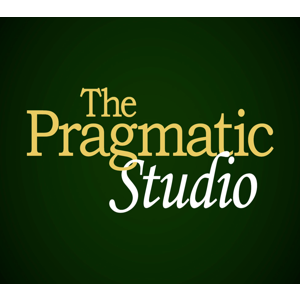

```
Roberto Nogueira  
BSd EE, MSd CE
Solution Integrator Experienced - Certified by Ericsson
```
# Pragmatic Studio project



**About**

Learn everything you need to about the subject of this `Pragmatic Studio` project.

[Homepage](https://online.pragmaticstudio.com/courses/elixir)

## Topics
```
[x] 1. Introduction
[x] 2. Create Mix Project
[x] 3. High-Level Transformations
[x] 4. Parse Request Line
[x] 5. Route and Response
[ ] 6. Function Clauses
[ ] 7. Request Params and Status Codes
[ ] 8. Rewrite Paths and Track 404s
[ ] 9. Serve Static Files
[ ] 10. Module Attributes
[ ] 11. Organizing Code
[ ] 12. Modeling With Structs
[ ] 13. Handle POST Requests
[ ] 14. Recursion
[ ] 15. Slicing and Dicing with Enum
[ ] 16. Comprehensions
[ ] 17. A Peek At Phoenix
[ ] 18. Test Automation
[ ] 19. Rendering JSON
[ ] 20. Web Server Sockets
[ ] 21. Concurrent, Isolated Processes
[ ] 22. Sending and Receiving Messages
[ ] 23. Asynchronous Tasks
[ ] 24. Stateful Server Processes
[ ] 25. Refactoring Toward GenServer
[ ] 26. OTP GenServer
[ ] 27. Another GenServer
[ ] 28. Linking Processes
[ ] 29. Fault Recovery with OTP Supervisors
[ ] 30. Final OTP Application
```
